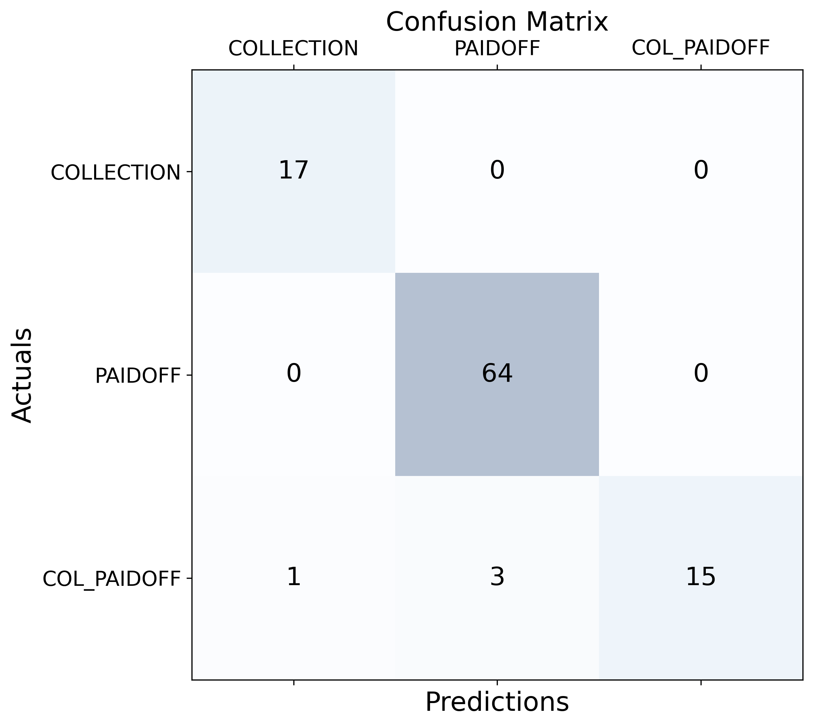

Loan Payment Prediction
==============================

### Project Description
- A simple model to predict the user's ability to pay the loan.
- A part of my team's term-end assignment for the course **Data Warehousing - INT3207 1** at UET.
- Team members:
    - [21020035 Nguyễn Huy Thái](https://www.facebook.com/huythai855/)
    - [21020327 Nguyễn Đức Hùng](https://www.facebook.com/hung1pmilo)
    - [21020365 Đỗ Tuấn Nghĩa](https://www.facebook.com/nghia.cangao)
    - [21020291 Trần Anh Dũng](https://www.facebook.com/trananhdung2801)
    - [20020335 Kha Văn Thương](https://www.facebook.com/kvt1080)

### Dataset
- You can download the data set from [here](https://www.kaggle.com/datasets/zhijinzhai/loandata).

### Installation
- Clone the repository
  ```bash
    git clone https://github.com/huythai855/loan-payment-prediction
  ```
- Change the data files in the `data/raw` folder.
- Install the requirements
  ```bash
    pip install -r requirements.txt
  ```
- Run the project
  ```bash
    python3 src/models/train_model.py
  ```
- The result visualization will be saved in the `reports/figures` folder.

### Sample Result
 

### Project Organization
    ├── README.md                         <- This description file
    ├── data
    │   ├── processed               <- The splited and preprocessed data.
    │   └── raw                     <- The original data.
    │
    ├── models                   
    │   └── MRL.pkl                 <- Sample trained model.
    │
    ├── reports            
    │   └── figures        
    │     └── plot.png         <- Resulting plot based on the data.
    │
    ├── requirements.txt                <- The requirement libraries to set up the environment.
    │
    ├── setup.py                        <- Makes project pip installable (pip install -e .).
    └── src
       │
       ├── data
       │ └── make_dataset.py      <- Splits and preprocesses the data.
       │
       ├── models
       │   ├── evaluate_model.py     <- Evaluates the model accurancy.
       │   └── train_model.py        <- Trains the model.
       │
       └── visualization
           └── visualize.py   <- Visualizes and exports the result.

